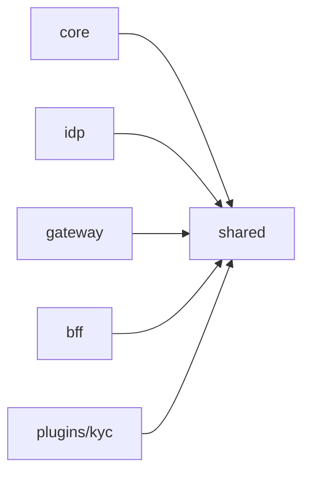

# Auto-generated — Gradle project dependencies (parsed from build.gradle.kts).

```mermaid
flowchart LR
    core["core "]
    core --> shared
    idp["idp "]
    idp --> shared
    gateway["gateway "]
    gateway --> shared
    bff["bff "]
    bff --> shared
    shared["shared "]
    p-kyc["plugins/kyc "]
    p-kyc --> shared
```
